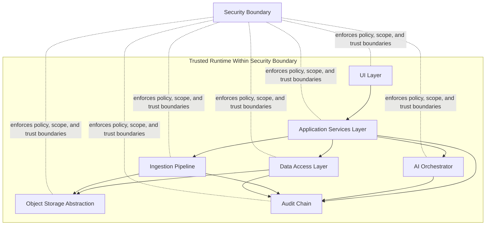

# KORDA Architecture Blueprint (v1)

## 1) System Architecture Diagram


## 2) Layer Responsibilities and Prohibitions

### UI Layer
Responsibilities:
- Render project-scoped views and collect user intents.
- Submit commands and queries to Application Services only.
- Display citations, provenance, and audit references returned by services.

MUST NOT:
- Access filesystem APIs directly.
- Call model providers or external AI APIs directly.
- Execute project-unscoped queries.

### Application Services Layer
Responsibilities:
- Enforce ProjectContext and policy checks on every request.
- Coordinate DAL, ObjectStore, IngestionPipeline, AiOrchestrator, and AuditAppender.
- Issue immutable finalize operations and version transitions.

MUST NOT:
- Bypass PolicyEnforcer for external AI or cross-client actions.
- Perform direct SQL or direct object-store driver calls.
- Return un-cited AI responses for claims requiring support.

### Data Access Layer
Responsibilities:
- Execute typed repository operations for metadata and indexes.
- Enforce project scoping in all reads/writes.
- Persist metadata and references to hash-addressed artifacts.

MUST NOT:
- Store plaintext secrets.
- Write outside schema/version constraints.
- Mutate immutable deliverable records after finalization.

### Object Storage Abstraction
Responsibilities:
- Store and fetch immutable blobs by sha256 content address.
- Verify content hash on write and read.
- Return canonical object references for metadata persistence.

MUST NOT:
- Accept caller-specified mutable overwrite semantics.
- Expose provider-specific SDK details to upper layers.
- Store data without hash verification.

### AI Orchestrator
Responsibilities:
- Build retrieval context from project-scoped artifacts.
- Execute model calls through approved adapters with policy gates.
- Emit citations and provenance metadata for responses.

MUST NOT:
- Run external AI calls without PolicyEnforcer approval.
- Access raw storage backends directly.
- Return responses without traceable source references.

### Ingestion Pipeline
Responsibilities:
- Normalize incoming files/content and compute sha256 hash.
- Write artifact blob via ObjectStore and metadata via repositories.
- Append audit entries for ingest lifecycle events.

MUST NOT:
- Accept unsupported content without explicit rejection event.
- Write metadata before object hash and boundary checks pass.
- Bypass audit append on ingest success/failure paths.

### Audit Chain
Responsibilities:
- Append immutable audit events for all state changes.
- Chain events with previous-hash linkage for tamper evidence.
- Provide verification and replay support for defensibility.

MUST NOT:
- Update or delete existing audit events.
- Allow unscoped or unauthenticated append operations.
- Accept writes missing actor, project, timestamp, or hash link.

### Security Boundary
Responsibilities:
- Enforce client/project isolation and request authorization.
- Enforce external AI restrictions and override policy path.
- Gate data egress, adapter invocation, and sensitive operations.

MUST NOT:
- Permit cross-client reads/writes.
- Permit UI-initiated privileged direct calls.
- Permit policy bypass in degraded or error states.

## 3) Data Flows

### A) Ingest Artifact
1. UI submits ingest command to Application Services with `ProjectContext`; boundary enforcement validates client/project scope.
2. IngestionPipeline computes `sha256` for payload and validates allowed type/policy.
3. ObjectStore writes blob under content-addressed key (`sha256`) and verifies read-back hash.
4. Data Access Layer writes artifact metadata (hash, media type, size, source, timestamp, project id).
5. Audit Chain appends immutable ingest event with actor, project, artifact id, `sha256`, and previous-hash link.
6. Application Services returns artifact reference and provenance; UI renders status only.

### B) Ask AI Question (RAG)
1. UI sends question to Application Services with `ProjectContext`; boundary enforcement blocks cross-project access.
2. Application Services requests candidate artifacts from DAL, scoped by project and policy.
3. AiOrchestrator retrieves approved context and validates each artifact `sha256` reference.
4. PolicyEnforcer evaluates external AI policy; default restricted path blocks or requires approved override.
5. AiOrchestrator executes model call via adapter, attaches citation metadata and artifact hashes.
6. DAL writes interaction metadata (prompt envelope, model id, citations, timestamps, project id).
7. Audit Chain appends immutable AI-query event with policy decision, metadata reference, and hash link.
8. Application Services returns answer with citations; UI displays response and provenance.

### C) Finalize Deliverable (Immutability)
1. UI requests finalize action through Application Services; boundary enforcement validates role and project scope.
2. Application Services composes deliverable payload from approved artifacts and citations.
3. System computes deliverable `sha256` and stores immutable blob via ObjectStore.
4. DAL writes finalized deliverable metadata (version, hash, inputs, timestamp, project id, status=`final`).
5. Audit Chain appends immutable finalize event including deliverable id, version, `sha256`, and previous-hash link.
6. Application Services blocks any later mutation; only superseding versions are allowed.
7. UI receives finalized reference; no filesystem interaction occurs in UI.

## 4) Explicit Boundary Statement
UI never touches filesystem; all filesystem and storage operations are mediated by Application Services and adapter interfaces.

## 5) TypeScript Interface Skeletons
```ts
export type ProjectId = string;
export type ActorId = string;
export type Sha256 = string;
export type IsoUtc = string;

export interface ProjectContext {
  projectId: ProjectId;
  actorId: ActorId;
}

export interface ArtifactObjectRef {
  sha256: Sha256;
  sizeBytes: number;
  mediaType: string;
}

export interface ArtifactMetadata {
  artifactId: string;
  projectId: ProjectId;
  sha256: Sha256;
  mediaType: string;
  sizeBytes: number;
  source: string;
  createdAtUtc: IsoUtc;
}

export interface AuditEventInput {
  projectId: ProjectId;
  actorId: ActorId;
  action: string;
  entityType: string;
  entityId: string;
  metadataRef?: string;
  sha256?: Sha256;
}

export interface AuditEvent {
  eventId: string;
  projectId: ProjectId;
  actorId: ActorId;
  action: string;
  entityType: string;
  entityId: string;
  occurredAtUtc: IsoUtc;
  prevHash: Sha256 | null;
  eventHash: Sha256;
}

export interface Citation {
  artifactId: string;
  sha256: Sha256;
  locator: string;
}

export interface ObjectStore {
  putImmutable(ctx: ProjectContext, content: Uint8Array, mediaType: string): Promise<ArtifactObjectRef>;
  getByHash(ctx: ProjectContext, sha256: Sha256): Promise<Uint8Array>;
  exists(ctx: ProjectContext, sha256: Sha256): Promise<boolean>;
}

export interface ArtifactRepository {
  createMetadata(ctx: ProjectContext, metadata: Omit<ArtifactMetadata, "artifactId">): Promise<ArtifactMetadata>;
  getById(ctx: ProjectContext, artifactId: string): Promise<ArtifactMetadata | null>;
  listByProject(ctx: ProjectContext): Promise<ArtifactMetadata[]>;
}

export interface AuditAppender {
  append(ctx: ProjectContext, input: AuditEventInput): Promise<AuditEvent>;
  verifyChain(ctx: ProjectContext): Promise<{ ok: boolean; brokenEventId?: string }>;
}

export interface AiOrchestrator {
  answerQuestion(
    ctx: ProjectContext,
    question: string,
    artifactIds: string[]
  ): Promise<{ answer: string; citations: Citation[]; responseId: string }>;
}

export interface IngestionPipeline {
  ingest(
    ctx: ProjectContext,
    input: { content: Uint8Array; mediaType: string; source: string }
  ): Promise<{ artifact: ArtifactMetadata; objectRef: ArtifactObjectRef }>;
}

export interface PolicyEnforcer {
  enforceProjectBoundary(ctx: ProjectContext, targetProjectId: ProjectId): Promise<void>;
  canUseExternalAi(ctx: ProjectContext, providerId: string): Promise<{ allowed: boolean; reason?: string }>;
}
```

## Definition of Done
- Diagram includes all required architecture boxes and the security boundary.
- Each box includes responsibilities and MUST NOT constraints.
- All three data flows are stepwise and include sha256 hash, metadata write, audit append, and boundary enforcement.
- Explicit statement about UI filesystem prohibition is present.
- Required TypeScript interface skeletons are present with signatures only.

## Tests
1. Manual architecture review confirms every production code path maps to one box and does not violate any MUST NOT rule.
2. Verify UI modules contain no direct filesystem calls and no direct model provider calls.
3. Verify ingest flow persists object by sha256, then metadata, then appends audit event.
4. Verify RAG flow enforces ProjectContext and external AI policy checks before model call.
5. Verify finalize flow creates immutable version and blocks post-finalization mutation.
6. Verify audit chain validation succeeds and reports failure details when hash linkage is intentionally broken in test data.